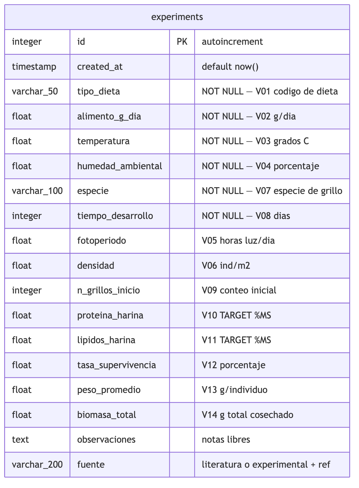

# GrillIA

GrillIA es un proyecto que usa inteligencia artificial para recomendar la
mejor dieta de cria de grillos, segun el animal al que va destinada la harina
(tilapia, pollo o cerdo). El objetivo es producir harina de grillo con alto
contenido de proteina (60-70%) para reemplazar las importaciones de harina de
pescado en Colombia.

> Aplicacion web del proyecto: **https://grilliaa.vercel.app**

- **Financiacion**: Minciencias, Convocatoria 963-2025 (Contrato 207-2025).
- **Ejecutor**: Universidad de los Llanos.
- **Investigadora Principal**: Dra. Monica Paola Higuera-Diaz.
- **Duracion**: 12 meses (Feb 2026 — Feb 2027).
- **Licencia**: Apache 2.0.

## Que es este repositorio

Este repositorio contiene la **estructura de datos** que usa GrillIA: la
definicion de todas las variables que se van a recolectar de los articulos
cientificos y de los experimentos en laboratorio para entrenar el modelo de
inteligencia artificial.

Piensalo como **la hoja de Excel maestra** que define que datos se guardan
y en que formato, pero almacenada en una base de datos para que el modelo
pueda leerla automaticamente.

## Como se ven los datos

Toda la informacion se guarda en una sola tabla llamada **`experiments`**.
Cada fila es un tratamiento experimental (una dieta probada en unas
condiciones especificas). Cada columna es una variable.

Las variables estan agrupadas asi:

| Grupo | Variables | Para que sirve |
|-------|-----------|----------------|
| **Dieta y alimentacion** | `tipo_dieta`, `alimento_g_dia` | Que les damos de comer a los grillos y cuanto. |
| **Condiciones de cria** | `temperatura`, `humedad_ambiental`, `fotoperiodo`, `densidad` | Como esta el ambiente donde viven. |
| **Grillo** | `especie`, `tiempo_desarrollo`, `n_grillos_inicio` | Que grillo se uso y cuanto tiempo se crio. |
| **Resultado nutricional** | `proteina_harina`, `lipidos_harina` | Lo que queremos predecir: la calidad nutricional de la harina. |
| **Resultado productivo** | `tasa_supervivencia`, `peso_promedio`, `biomasa_total` | Cuantos grillos sobrevivieron y cuanto pesaron. |
| **Metadata** | `observaciones`, `fuente`, `created_at` | De donde vino el dato (paper o experimento) y notas. |

## Captura de datos de literatura

La captura de datos de articulos cientificos se hace llenando la plantilla
[`data/literature/template.csv`](data/literature/template.csv) en Excel o
Google Sheets. Las instrucciones completas (que escribir en cada columna,
como nombrar las dietas, donde buscar los datos en los articulos) estan en
[`data/literature/INSTRUCCIONES.md`](data/literature/INSTRUCCIONES.md).

## En que parte del cronograma estamos

Este repositorio respalda el avance de la **Actividad 3.2** del cronograma
Minciencias (desarrollo del modelo de IA), especificamente la fase de
definicion del esquema de datos. La carga masiva de datos de literatura y
el entrenamiento del modelo viene en los meses siguientes.

## Recursos del repositorio

- [`docs/diagrams/er-diagram.svg`](docs/diagrams/er-diagram.svg) — Diagrama de la estructura de la tabla (tambien en PNG y como fuente Mermaid).
- [`docs/database-schema.md`](docs/database-schema.md) — Descripcion detallada de la tabla, tipos de datos, decisiones de diseno y comandos para aplicar la migracion.
- [`data/literature/INSTRUCCIONES.md`](data/literature/INSTRUCCIONES.md) — Guia para llenar la plantilla.
- [`data/literature/template.csv`](data/literature/template.csv) — Plantilla vacia.
- [`LICENSE`](LICENSE) — Licencia Apache 2.0.
